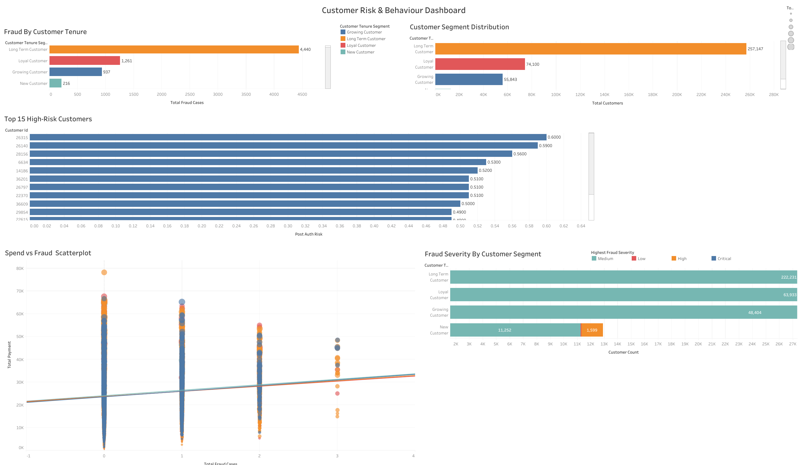
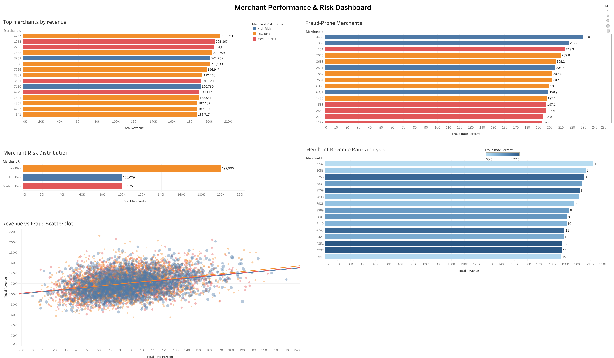

# fintech-fraud-analytics-pipeline

# End-to-End FinTech Fraud Detection & Risk Analytics Pipeline

## Project Overview

This project analyzes 400,000 fintech payment transactions to identify fraud patterns, customer risk behavior, merchant fraud exposure, and executive-level KPIs.

The project follows a complete analytics pipeline using:

- Python (Pandas, NumPy)
- SQL (MySQL)
- Tableau
- Feature Engineering
- Fraud Risk Segmentation

The goal was to simulate a real-world fintech fraud analytics system and create business-ready dashboards for fraud monitoring and risk analysis.

---

## Business Problem

Digital payment systems face increasing fraud risks.

The objective of this project was to:

- Detect suspicious transaction behavior
- Segment customers based on fraud and spending risk
- Identify high-risk merchants
- Analyze fraud trends and transaction patterns
- Create executive-level KPIs for decision making

---

## Tech Stack

- Python
- Pandas
- SQLAlchemy
- MySQL
- Tableau Public/Desktop

---

## Project Pipeline

1. Data Cleaning & Preprocessing in Python
2. Feature Engineering using Pandas & SQL
3. Data Storage in MySQL
4. SQL Views for Business Analytics
5. Interactive Dashboard Creation in Tableau

---

## Engineered Features

The following fraud intelligence features were created:

- Velocity Risk
- Fraud Severity
- International Risk Flag
- Spending Segment
- Transaction Size Segment
- Customer Tenure Segment
- Merchant Risk Status
- Risk Category

---

## SQL Analytical Views

Created business-focused SQL views:

### 1. Customer Summary
Customer-level fraud and behavior analytics.

### 2. Fraud Analysis
Transaction-level fraud investigation view.

### 3. Merchant Performance
Merchant fraud and revenue analysis.

### 4. Executive KPIs
Business-level fraud metrics and KPIs.

---

## Tableau Dashboards

### 1. Fraud Intelligence Dashboard
Fraud severity, payment channel analysis, device-level fraud, time analysis.

### 2. Customer Risk & Behavior Dashboard
Customer segmentation, high-risk customers, spending behavior.

### 3. Merchant Performance & Risk Dashboard
Merchant fraud analysis, revenue analysis, merchant risk segmentation.

### 4. Executive Fraud & Business Overview
Executive KPI monitoring and fraud business metrics.

---

## DASHBOARD SCREENSHOTS






## Key Insights

- Identified high-risk transaction patterns using velocity and fraud severity scoring.
- Segmented customers based on spending behavior and fraud exposure.
- Analyzed merchant-level fraud concentration and revenue performance.
- Built executive dashboards for fraud monitoring and business decisions.

---


## Project Structure

```text
fintech-fraud-analytics-pipeline/
│
├── data/
│   ├── dataset_info.txt
│
├── notebooks/
│   ├── fintech_fraud_analysis.ipynb
│
├── sql/
│   ├── schema_and_table_creation.sql
│   ├── feature_engineering.sql
│   ├── views_creation.sql
│
├── tableau/
│   ├── fintech_fraud_dashboard.twbx
│
├── dashboard_screenshots/
│   ├── fraud_intelligence_dashboard.png
│   ├── customer_risk_dashboard.png
│   ├── merchant_performance_dashboard.png
│   ├── executive_overview_dashboard.png
│
├── requirements.txt
├── README.md

```

# AUTHOR
## PANKAJ JUYAL


